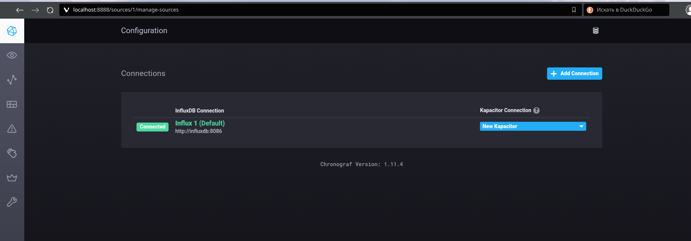
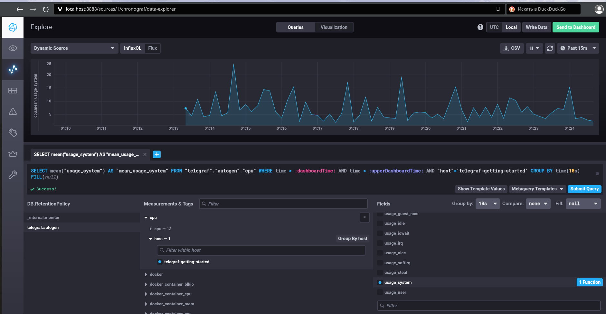
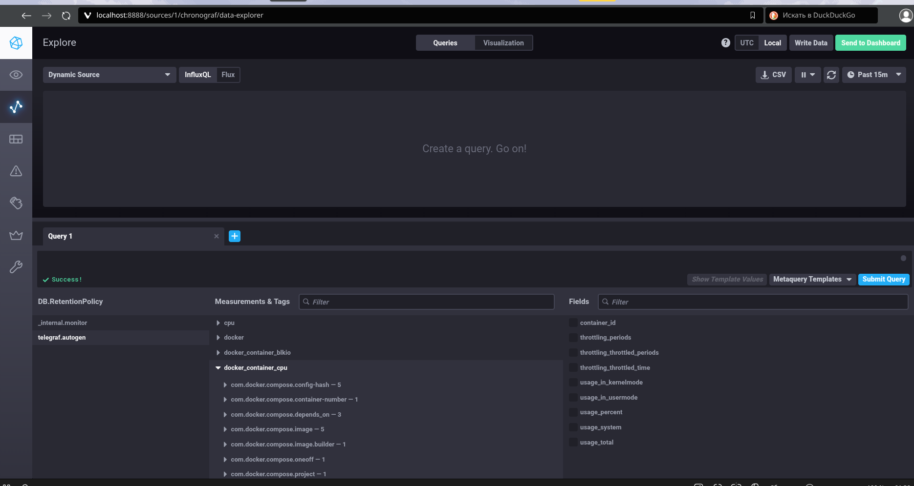

# Домашнее задание к занятию "13. Системы мониторинга" - Шаров Олег

## Задание 1. Минимальный набор метрик

Проект — платформа вычислений: HTTP-интерфейс, отчёты на диск, нагрузка на CPU. Минимум метрик:

**Системные:**
- **CPU (usage_user, usage_system, load average)** — вычисления загружают процессор; 100% утилизация означает деградацию и очереди.
- **RAM (used memory, swap)** — риск OOM-killer при тяжёлых вычислениях.
- **Disk (свободное место, свободные inodes, I/O wait)** — отчёты сохраняются на диск: закончится место или inodes — отчёт не сохранится, даже если вычисление прошло успешно.

**Прикладные (HTTP):**
- **RPS (запросов в секунду)** — востребованность сервиса.
- **Распределение HTTP-кодов (2xx/4xx/5xx)** — здоровье сервиса.
- **Время ответа (latency, 95-й перцентиль)** — скорость, которую чувствует пользователь.

Почему: набор закрывает и ресурсы, участвующие в вычислениях (CPU, RAM, диск), и качество сервиса, как его видит клиент (доступность и скорость HTTP).

## Задание 2. Что предложить продукт-менеджеру

PM не нужны системные метрики — ему нужно понимать качество обслуживания. Предлагаю бизнес-метрики (SLI/SLO):
- **Доступность**: процент успешных HTTP-запросов (например, 99% запросов возвращают 200 OK).
- **Скорость**: 95% отчётов генерируются быстрее N секунд.
- **Результативность**: отношение сохранённых отчётов к запрошенным.

А термины объяснить по-человечески:
- **RAM** — размер рабочего стола: чем больше, тем больше задач помещается без тормозов.
- **CPU la (load average)** — очередь в кассу: если очередь длиннее числа касс (ядер), клиенты ждут.
- **inodes** — количество папок в архиве: даже если склад пустой, без свободной папки новый отчёт положить некуда.

## Задание 3. Нет финансирования на систему сбора логов

Варианты:
1. **Open Source стеки**: Loki + Promtail + Grafana (легковесный и бесплатный) или ELK (Elasticsearch, Logstash, Kibana) — тяжелее, но тоже бесплатно.
2. Если ресурсов нет вообще: приложения уже пишут логи в файлы/stdout, поэтому настроить cron-скрипт, который ищет в логах ERROR/CRITICAL и отправляет их в Telegram-чат или на почту разработчикам. Разработчики видят ошибки, бюджет — ноль.

## Задание 4. Где ошибка в формуле SLA

Формула `sum_2xx / sum_all` даёт 70%, хотя 4xx/5xx нет. Ошибка в знаменателе: в `sum_all` попадают **3xx-редиректы** (и 1xx), которые не являются ошибками. Пример: клиент получил 301-редирект, затем 200 — это 2 запроса, из них только один 2xx, и SLA = 50% при полностью рабочем сервисе. Решение: исключить 1xx/3xx из знаменателя либо считать их успешными.

## Задание 5. Плюсы и минусы pull и push

**Pull (сервер сам опрашивает агентов — Prometheus, Nagios):**
Плюсы:
- агентам не нужно знать о сервере: они просто отдают метрики по порту;
- сервер сам управляет частотой опроса;
- отказ сервера мониторинга не затрагивает наблюдаемые хосты.
Минусы:
- задержка: о проблеме узнаём только при следующем опросе;
- сервер тратит ресурсы на обход тысяч эндпоинтов;
- если агент упал между опросами, часть данных теряется.

**Push (агенты сами шлют данные — Telegraf (TICK), StatsD):**
Плюсы:
- данные приходят почти в реальном времени;
- центральный сервер не тратит ресурсы на инициацию соединений;
- легко слать события в момент их возникновения.
Минусы:
- агент должен знать адрес сервера и иметь доступ к нему;
- при отказе сервера данные теряются, если у агента нет буфера;
- сложнее настройка агентов и вопросы безопасности (кто имеет право слать данные).

## Задание 6. Классификация систем

- **Prometheus** — pull.
- **TICK** — push (Telegraf сам отправляет данные в InfluxDB).
- **Zabbix** — гибрид (поддерживает и опрос агентов, и активные агенты, шлющие данные сами).
- **VictoriaMetrics** — гибрид с уклоном в push: обычно принимает данные по remote_write (push), но с vmagent умеет и сам собирать метрики (pull).
- **Nagios** — pull.

## Задание 7. Запуск TICK-стека

Склонирован репозиторий influxdata/sandbox, стек запущен через `docker compose up -d`.
Возникшие проблемы и решения:
- не была задана переменная `TYPE` — скопирован `.env-latest` в `.env`;
- контейнеры падали с permission denied на примонтированных папках — исправлены права и добавлен флаг `:Z` к volumes в docker-compose.yml;
- Telegraf не стартовал из-за устаревших опций плагина docker в конфиге — удалены опции `container_names`, `perdevice`, `total`;
- Chronograf не подключался к `localhost:8086` — внутри docker-сети сервисы доступны по именам, поэтому URL заменён на `http://influxdb:8086`.

Веб-интерфейс Chronograf, страница Connections (статус Connected):



## Задание 8. Data explorer

Построен график утилизации CPU: БД `telegraf.autogen`, measurement `cpu`, host `telegraf-getting-started`, field `usage_system`.
Эксперименты с запросом: изменено окно агрегации в GROUP BY на `time(10s)` и окно наблюдения (Past 15m). Чем крупнее окно группировки, тем глаже график — сырые точки усредняются по интервалам.



## Задание 9. Плагин docker для telegraf

В `telegraf/telegraf.conf` подключён плагин:

```
[[inputs.docker]]
  endpoint = "unix:///var/run/docker.sock"
```

В `docker-compose.yml` контейнеру telegraf добавлен режим `privileged: true` и проброс `/var/run/docker.sock`. После перезапуска telegraf в базе `telegraf.autogen` появились метрики docker:


